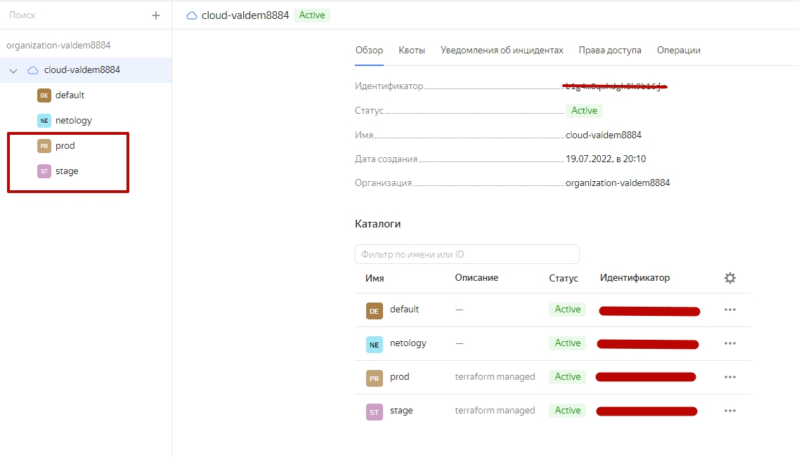

# Домашнее задание к занятию "7.3. Основы и принцип работы Терраформ" dev-17_terraform-basic-yakovlev_vs
terraform-basic

## Задача 1. Создадим бэкэнд в S3 (необязательно, но крайне желательно).

Если в рамках предыдущего задания у вас уже есть аккаунт AWS, то давайте продолжим знакомство со взаимодействием
терраформа и aws. 

1. Создайте s3 бакет, iam роль и пользователя от которого будет работать терраформ. Можно создать отдельного пользователя,
а можно использовать созданного в рамках предыдущего задания, просто добавьте ему необходимы права, как описано 
[здесь](https://www.terraform.io/docs/backends/types/s3.html).
2. Зарегистрируйте бэкэнд в терраформ проекте как описано по ссылке выше. 

#### Решение

1. Добавить S3-бакет с помощью ресурсов aws_s3_bucket и aws_dynamodb_table в конфигурации Terraform:
```bash
resource "aws_s3_bucket" "terraform_state" {
  bucket = "valdem88-netology-terraform-state"

  versioning {
    enabled = true
  }
}

resource "aws_dynamodb_table" "terraform_locks" {
  name         = "terraform-lock"
  billing_mode = "PAY_PER_REQUEST"
  hash_key     = "LockID"

  attribute {
    name = "LockID"
    type = "S"
  }
} 
```
2. Добавить backend s3:
```bash
terraform {
  backend "s3" {
    bucket         = "valdem88-netology-terraform-state"
    key            = "state/terraform.tfstate"
    region         = "eu-west-3"
    dynamodb_table = "terraform-lock"
    encrypt        = true
  }
}
```

#### Нашел вариант решения. Проверить не представляется возможным. Невозможно создать аккаунт на aws с территории России 


## Задача 2. Инициализируем проект и создаем воркспейсы. 

1. Выполните `terraform init`:
    * если был создан бэкэнд в S3, то терраформ создат файл стейтов в S3 и запись в таблице 
dynamodb.
    * иначе будет создан локальный файл со стейтами.  
1. Создайте два воркспейса `stage` и `prod`.
1. В уже созданный `aws_instance` добавьте зависимость типа инстанса от вокспейса, что бы в разных ворскспейсах 
использовались разные `instance_type`.
1. Добавим `count`. Для `stage` должен создаться один экземпляр `ec2`, а для `prod` два. 
1. Создайте рядом еще один `aws_instance`, но теперь определите их количество при помощи `for_each`, а не `count`.
1. Что бы при изменении типа инстанса не возникло ситуации, когда не будет ни одного инстанса добавьте параметр
жизненного цикла `create_before_destroy = true` в один из рессурсов `aws_instance`.
1. При желании поэкспериментируйте с другими параметрами и рессурсами.

В виде результата работы пришлите:
* Вывод команды `terraform workspace list`.
* Вывод команды `terraform plan` для воркспейса `prod`. 

#### Решение

- Makefile

```bash
ENV?=default

all: init workspace plan apply pause

init:
	cd ./terraform/demo && terraform init

workspace:
	cd ./terraform/demo && terraform workspace new ${ENV}

set_workspace:
	cd ./terraform/demo && terraform workspace select ${ENV}

plan: set_workspace
	cd ./terraform/demo && terraform plan

apply: set_workspace
	cd ./terraform/demo && terraform apply -auto-approve

destroy: set_workspace
	cd ./terraform/demo && terraform destroy -auto-approve

clean:
	cd ./terraform/demo &&  rm -f terraform.tfplan
	cd ./terraform/demo &&  rm -f .terraform.lock.hcl
	cd ./terraform/demo &&  rm -fr terraform.tfstate*
	cd ./terraform/demo &&  rm -fr .terraform/

pause:
	echo "Wait for 60 seconds stupid Yandex Cloud creating a VM's..."
	sleep 60
	echo "May be created? Ok..."
```

1. Вывод команды `terraform workspace list`.

```bash
root@server1:~/terr_demo/terraform/demo# terraform workspace list
  default
  prod
* stage
```



2. Вывод команды `terraform plan` для воркспейса `prod`.
```bash
root@server1:~/terr_demo# ENV=prod make all
cd ./terraform/demo && terraform init
Initializing modules...
- news in ../modules/instance
Downloading registry.terraform.io/hamnsk/vpc/yandex 0.5.0 for vpc...
- vpc in .terraform/modules/vpc

Initializing the backend...

Initializing provider plugins...
- Finding yandex-cloud/yandex versions matching "0.61.0, ~> 0.61.0"...
- Installing yandex-cloud/yandex v0.61.0...
- Installed yandex-cloud/yandex v0.61.0 (unauthenticated)

Terraform has created a lock file .terraform.lock.hcl to record the provider
selections it made above. Include this file in your version control repository
so that Terraform can guarantee to make the same selections by default when
you run "terraform init" in the future.

╷
│ Warning: Incomplete lock file information for providers
│
│ Due to your customized provider installation methods, Terraform was forced to calculate lock file checksums locally for the
│ following providers:
│   - yandex-cloud/yandex
│
│ The current .terraform.lock.hcl file only includes checksums for linux_amd64, so Terraform running on another platform will fail
│ to install these providers.
│
│ To calculate additional checksums for another platform, run:
│   terraform providers lock -platform=linux_amd64
│ (where linux_amd64 is the platform to generate)
╵

Terraform has been successfully initialized!

You may now begin working with Terraform. Try running "terraform plan" to see
any changes that are required for your infrastructure. All Terraform commands
should now work.

If you ever set or change modules or backend configuration for Terraform,
rerun this command to reinitialize your working directory. If you forget, other
commands will detect it and remind you to do so if necessary.
cd ./terraform/demo && terraform workspace new prod
Created and switched to workspace "prod"!

You're now on a new, empty workspace. Workspaces isolate their state,
so if you run "terraform plan" Terraform will not see any existing state
for this configuration.
cd ./terraform/demo && terraform workspace select prod
cd ./terraform/demo && terraform plan
module.vpc.data.yandex_compute_image.nat_instance: Reading...
module.vpc.data.yandex_compute_image.nat_instance: Read complete after 4s [id=fd8v7ru46kt3s4o5f0uo]

Terraform used the selected providers to generate the following execution plan. Resource actions are indicated with the following
symbols:
  + create
 <= read (data resources)

Terraform will perform the following actions:

  # module.news.data.yandex_compute_image.image will be read during apply
  # (depends on a resource or a module with changes pending)
 <= data "yandex_compute_image" "image" {
      + created_at    = (known after apply)
      + description   = (known after apply)
      + family        = "centos-7"
      + folder_id     = (known after apply)
      + id            = (known after apply)
      + image_id      = (known after apply)
      + labels        = (known after apply)
      + min_disk_size = (known after apply)
      + name          = (known after apply)
      + os_type       = (known after apply)
      + product_ids   = (known after apply)
      + size          = (known after apply)
      + status        = (known after apply)
    }

  # module.news.yandex_compute_instance.instance[0] will be created
  + resource "yandex_compute_instance" "instance" {
      + created_at                = (known after apply)
      + description               = "News App Demo"
      + folder_id                 = (known after apply)
      + fqdn                      = (known after apply)
      + hostname                  = "news-1"
      + id                        = (known after apply)
      + metadata                  = {
          + "ssh-keys" = <<-EOT
                centos:ssh-rsa AAAAB3NzaC1yc2EAAAADAQABAAABgQDCA9SzDj6gX6Kno27qlWIh3yOU5LygCrTO1A21HtXUHfWg/vcgrvsKGNIG0D2aZF/zeZQsA8t/7ChY44TTrB39mHG55dkqys0y7WDU3BNWYUcHntG+SCUddC+QKcb6e4RdZyF/W+4WeWewIct370X9PqMXImgIxrzExrpAJQmwIJDfcvtzsrL6jOY+TSEA0Fh5HsAVRnCM7EEV0nfsD8aDTqtpLKNqJaAXZb+CmL8/etYXtdyy3jqpLn35+9h/8Czhmr/ru5U2TtWtn89kHeQg8gXyM4q8tdV4N0fLOkRwH+my8rBGd7m/A+WAxJefMWZ08qqvH1LJ7Qh+rqo47QJiW72mEgzP2ahBoDFBTo20X8bMz1HSz0JDCufyRaCFRuFDiQK53fCyYZKVBlgt/M5bQhEXUO3RvpWt7kerPHdqClBjBh8KIcMmVY9i6JamRMTyDX1mKfyhfizEA5BzT3oz/jkQnYztvqH45O5Hudz4VNtp/weH7gpaG/tguOy6Xbs= root@server1
            EOT
        }
      + name                      = "news-1"
      + network_acceleration_type = "standard"
      + platform_id               = "standard-v2"
      + service_account_id        = (known after apply)
      + status                    = (known after apply)
      + zone                      = "ru-central1-a"

      + boot_disk {
          + auto_delete = true
          + device_name = (known after apply)
          + disk_id     = (known after apply)
          + mode        = (known after apply)

          + initialize_params {
              + description = (known after apply)
              + image_id    = (known after apply)
              + name        = (known after apply)
              + size        = 40
              + snapshot_id = (known after apply)
              + type        = "network-ssd"
            }
        }

      + network_interface {
          + index              = (known after apply)
          + ip_address         = (known after apply)
          + ipv4               = true
          + ipv6               = (known after apply)
          + ipv6_address       = (known after apply)
          + mac_address        = (known after apply)
          + nat                = true
          + nat_ip_address     = (known after apply)
          + nat_ip_version     = (known after apply)
          + security_group_ids = (known after apply)
          + subnet_id          = (known after apply)
        }

      + placement_policy {
          + placement_group_id = (known after apply)
        }

      + resources {
          + core_fraction = 100
          + cores         = 2
          + memory        = 2
        }

      + scheduling_policy {
          + preemptible = (known after apply)
        }
    }

  # module.news.yandex_compute_instance.instance[1] will be created
  + resource "yandex_compute_instance" "instance" {
      + created_at                = (known after apply)
      + description               = "News App Demo"
      + folder_id                 = (known after apply)
      + fqdn                      = (known after apply)
      + hostname                  = "news-2"
      + id                        = (known after apply)
      + metadata                  = {
          + "ssh-keys" = <<-EOT
                centos:ssh-rsa AAAAB3NzaC1yc2EAAAADAQABAAABgQDCA9SzDj6gX6Kno27qlWIh3yOU5LygCrTO1A21HtXUHfWg/vcgrvsKGNIG0D2aZF/zeZQsA8t/7ChY44TTrB39mHG55dkqys0y7WDU3BNWYUcHntG+SCUddC+QKcb6e4RdZyF/W+4WeWewIct370X9PqMXImgIxrzExrpAJQmwIJDfcvtzsrL6jOY+TSEA0Fh5HsAVRnCM7EEV0nfsD8aDTqtpLKNqJaAXZb+CmL8/etYXtdyy3jqpLn35+9h/8Czhmr/ru5U2TtWtn89kHeQg8gXyM4q8tdV4N0fLOkRwH+my8rBGd7m/A+WAxJefMWZ08qqvH1LJ7Qh+rqo47QJiW72mEgzP2ahBoDFBTo20X8bMz1HSz0JDCufyRaCFRuFDiQK53fCyYZKVBlgt/M5bQhEXUO3RvpWt7kerPHdqClBjBh8KIcMmVY9i6JamRMTyDX1mKfyhfizEA5BzT3oz/jkQnYztvqH45O5Hudz4VNtp/weH7gpaG/tguOy6Xbs= root@server1
            EOT
        }
      + name                      = "news-2"
      + network_acceleration_type = "standard"
      + platform_id               = "standard-v2"
      + service_account_id        = (known after apply)
      + status                    = (known after apply)
      + zone                      = "ru-central1-a"

      + boot_disk {
          + auto_delete = true
          + device_name = (known after apply)
          + disk_id     = (known after apply)
          + mode        = (known after apply)

          + initialize_params {
              + description = (known after apply)
              + image_id    = (known after apply)
              + name        = (known after apply)
              + size        = 40
              + snapshot_id = (known after apply)
              + type        = "network-ssd"
            }
        }

      + network_interface {
          + index              = (known after apply)
          + ip_address         = (known after apply)
          + ipv4               = true
          + ipv6               = (known after apply)
          + ipv6_address       = (known after apply)
          + mac_address        = (known after apply)
          + nat                = true
          + nat_ip_address     = (known after apply)
          + nat_ip_version     = (known after apply)
          + security_group_ids = (known after apply)
          + subnet_id          = (known after apply)
        }

      + placement_policy {
          + placement_group_id = (known after apply)
        }

      + resources {
          + core_fraction = 100
          + cores         = 2
          + memory        = 2
        }

      + scheduling_policy {
          + preemptible = (known after apply)
        }
    }

  # module.vpc.yandex_resourcemanager_folder.folder[0] will be created
  + resource "yandex_resourcemanager_folder" "folder" {
      + cloud_id    = (known after apply)
      + created_at  = (known after apply)
      + description = "terraform managed"
      + id          = (known after apply)
      + name        = "prod"
    }

  # module.vpc.yandex_vpc_network.this will be created
  + resource "yandex_vpc_network" "this" {
      + created_at                = (known after apply)
      + default_security_group_id = (known after apply)
      + description               = "managed by terraform prod network"
      + folder_id                 = (known after apply)
      + id                        = (known after apply)
      + name                      = "prod"
      + subnet_ids                = (known after apply)
    }

  # module.vpc.yandex_vpc_subnet.this["ru-central1-a"] will be created
  + resource "yandex_vpc_subnet" "this" {
      + created_at     = (known after apply)
      + description    = "managed by terraform prod subnet for zone ru-central1-a"
      + folder_id      = (known after apply)
      + id             = (known after apply)
      + name           = "prod-ru-central1-a"
      + network_id     = (known after apply)
      + v4_cidr_blocks = [
          + "10.128.0.0/24",
        ]
      + v6_cidr_blocks = (known after apply)
      + zone           = "ru-central1-a"
    }

  # module.vpc.yandex_vpc_subnet.this["ru-central1-b"] will be created
  + resource "yandex_vpc_subnet" "this" {
      + created_at     = (known after apply)
      + description    = "managed by terraform prod subnet for zone ru-central1-b"
      + folder_id      = (known after apply)
      + id             = (known after apply)
      + name           = "prod-ru-central1-b"
      + network_id     = (known after apply)
      + v4_cidr_blocks = [
          + "10.129.0.0/24",
        ]
      + v6_cidr_blocks = (known after apply)
      + zone           = "ru-central1-b"
    }

  # module.vpc.yandex_vpc_subnet.this["ru-central1-c"] will be created
  + resource "yandex_vpc_subnet" "this" {
      + created_at     = (known after apply)
      + description    = "managed by terraform prod subnet for zone ru-central1-c"
      + folder_id      = (known after apply)
      + id             = (known after apply)
      + name           = "prod-ru-central1-c"
      + network_id     = (known after apply)
      + v4_cidr_blocks = [
          + "10.130.0.0/24",
        ]
      + v6_cidr_blocks = (known after apply)
      + zone           = "ru-central1-c"
    }

Plan: 7 to add, 0 to change, 0 to destroy.

──────────────────────────────────────────────────────────────────────────────────────────────────────────────────────────────────

Note: You didn't use the -out option to save this plan, so Terraform can't guarantee to take exactly these actions if you run
"terraform apply" now.
cd ./terraform/demo && terraform apply -auto-approve
module.vpc.data.yandex_compute_image.nat_instance: Reading...
module.vpc.data.yandex_compute_image.nat_instance: Read complete after 3s [id=fd8v7ru46kt3s4o5f0uo]

Terraform used the selected providers to generate the following execution plan. Resource actions are indicated with the following
symbols:
  + create
 <= read (data resources)

Terraform will perform the following actions:

  # module.news.data.yandex_compute_image.image will be read during apply
  # (depends on a resource or a module with changes pending)
 <= data "yandex_compute_image" "image" {
      + created_at    = (known after apply)
      + description   = (known after apply)
      + family        = "centos-7"
      + folder_id     = (known after apply)
      + id            = (known after apply)
      + image_id      = (known after apply)
      + labels        = (known after apply)
      + min_disk_size = (known after apply)
      + name          = (known after apply)
      + os_type       = (known after apply)
      + product_ids   = (known after apply)
      + size          = (known after apply)
      + status        = (known after apply)
    }

  # module.news.yandex_compute_instance.instance[0] will be created
  + resource "yandex_compute_instance" "instance" {
      + created_at                = (known after apply)
      + description               = "News App Demo"
      + folder_id                 = (known after apply)
      + fqdn                      = (known after apply)
      + hostname                  = "news-1"
      + id                        = (known after apply)
      + metadata                  = {
          + "ssh-keys" = <<-EOT
                centos:ssh-rsa AAAAB3NzaC1yc2EAAAADAQABAAABgQDCA9SzDj6gX6Kno27qlWIh3yOU5LygCrTO1A21HtXUHfWg/vcgrvsKGNIG0D2aZF/zeZQsA8t/7ChY44TTrB39mHG55dkqys0y7WDU3BNWYUcHntG+SCUddC+QKcb6e4RdZyF/W+4WeWewIct370X9PqMXImgIxrzExrpAJQmwIJDfcvtzsrL6jOY+TSEA0Fh5HsAVRnCM7EEV0nfsD8aDTqtpLKNqJaAXZb+CmL8/etYXtdyy3jqpLn35+9h/8Czhmr/ru5U2TtWtn89kHeQg8gXyM4q8tdV4N0fLOkRwH+my8rBGd7m/A+WAxJefMWZ08qqvH1LJ7Qh+rqo47QJiW72mEgzP2ahBoDFBTo20X8bMz1HSz0JDCufyRaCFRuFDiQK53fCyYZKVBlgt/M5bQhEXUO3RvpWt7kerPHdqClBjBh8KIcMmVY9i6JamRMTyDX1mKfyhfizEA5BzT3oz/jkQnYztvqH45O5Hudz4VNtp/weH7gpaG/tguOy6Xbs= root@server1
            EOT
        }
      + name                      = "news-1"
      + network_acceleration_type = "standard"
      + platform_id               = "standard-v2"
      + service_account_id        = (known after apply)
      + status                    = (known after apply)
      + zone                      = "ru-central1-a"

      + boot_disk {
          + auto_delete = true
          + device_name = (known after apply)
          + disk_id     = (known after apply)
          + mode        = (known after apply)

          + initialize_params {
              + description = (known after apply)
              + image_id    = (known after apply)
              + name        = (known after apply)
              + size        = 40
              + snapshot_id = (known after apply)
              + type        = "network-ssd"
            }
        }

      + network_interface {
          + index              = (known after apply)
          + ip_address         = (known after apply)
          + ipv4               = true
          + ipv6               = (known after apply)
          + ipv6_address       = (known after apply)
          + mac_address        = (known after apply)
          + nat                = true
          + nat_ip_address     = (known after apply)
          + nat_ip_version     = (known after apply)
          + security_group_ids = (known after apply)
          + subnet_id          = (known after apply)
        }

      + placement_policy {
          + placement_group_id = (known after apply)
        }

      + resources {
          + core_fraction = 100
          + cores         = 2
          + memory        = 2
        }

      + scheduling_policy {
          + preemptible = (known after apply)
        }
    }

  # module.news.yandex_compute_instance.instance[1] will be created
  + resource "yandex_compute_instance" "instance" {
      + created_at                = (known after apply)
      + description               = "News App Demo"
      + folder_id                 = (known after apply)
      + fqdn                      = (known after apply)
      + hostname                  = "news-2"
      + id                        = (known after apply)
      + metadata                  = {
          + "ssh-keys" = <<-EOT
                centos:ssh-rsa AAAAB3NzaC1yc2EAAAADAQABAAABgQDCA9SzDj6gX6Kno27qlWIh3yOU5LygCrTO1A21HtXUHfWg/vcgrvsKGNIG0D2aZF/zeZQsA8t/7ChY44TTrB39mHG55dkqys0y7WDU3BNWYUcHntG+SCUddC+QKcb6e4RdZyF/W+4WeWewIct370X9PqMXImgIxrzExrpAJQmwIJDfcvtzsrL6jOY+TSEA0Fh5HsAVRnCM7EEV0nfsD8aDTqtpLKNqJaAXZb+CmL8/etYXtdyy3jqpLn35+9h/8Czhmr/ru5U2TtWtn89kHeQg8gXyM4q8tdV4N0fLOkRwH+my8rBGd7m/A+WAxJefMWZ08qqvH1LJ7Qh+rqo47QJiW72mEgzP2ahBoDFBTo20X8bMz1HSz0JDCufyRaCFRuFDiQK53fCyYZKVBlgt/M5bQhEXUO3RvpWt7kerPHdqClBjBh8KIcMmVY9i6JamRMTyDX1mKfyhfizEA5BzT3oz/jkQnYztvqH45O5Hudz4VNtp/weH7gpaG/tguOy6Xbs= root@server1
            EOT
        }
      + name                      = "news-2"
      + network_acceleration_type = "standard"
      + platform_id               = "standard-v2"
      + service_account_id        = (known after apply)
      + status                    = (known after apply)
      + zone                      = "ru-central1-a"

      + boot_disk {
          + auto_delete = true
          + device_name = (known after apply)
          + disk_id     = (known after apply)
          + mode        = (known after apply)

          + initialize_params {
              + description = (known after apply)
              + image_id    = (known after apply)
              + name        = (known after apply)
              + size        = 40
              + snapshot_id = (known after apply)
              + type        = "network-ssd"
            }
        }

      + network_interface {
          + index              = (known after apply)
          + ip_address         = (known after apply)
          + ipv4               = true
          + ipv6               = (known after apply)
          + ipv6_address       = (known after apply)
          + mac_address        = (known after apply)
          + nat                = true
          + nat_ip_address     = (known after apply)
          + nat_ip_version     = (known after apply)
          + security_group_ids = (known after apply)
          + subnet_id          = (known after apply)
        }

      + placement_policy {
          + placement_group_id = (known after apply)
        }

      + resources {
          + core_fraction = 100
          + cores         = 2
          + memory        = 2
        }

      + scheduling_policy {
          + preemptible = (known after apply)
        }
    }

  # module.vpc.yandex_resourcemanager_folder.folder[0] will be created
  + resource "yandex_resourcemanager_folder" "folder" {
      + cloud_id    = (known after apply)
      + created_at  = (known after apply)
      + description = "terraform managed"
      + id          = (known after apply)
      + name        = "prod"
    }

  # module.vpc.yandex_vpc_network.this will be created
  + resource "yandex_vpc_network" "this" {
      + created_at                = (known after apply)
      + default_security_group_id = (known after apply)
      + description               = "managed by terraform prod network"
      + folder_id                 = (known after apply)
      + id                        = (known after apply)
      + name                      = "prod"
      + subnet_ids                = (known after apply)
    }

  # module.vpc.yandex_vpc_subnet.this["ru-central1-a"] will be created
  + resource "yandex_vpc_subnet" "this" {
      + created_at     = (known after apply)
      + description    = "managed by terraform prod subnet for zone ru-central1-a"
      + folder_id      = (known after apply)
      + id             = (known after apply)
      + name           = "prod-ru-central1-a"
      + network_id     = (known after apply)
      + v4_cidr_blocks = [
          + "10.128.0.0/24",
        ]
      + v6_cidr_blocks = (known after apply)
      + zone           = "ru-central1-a"
    }

  # module.vpc.yandex_vpc_subnet.this["ru-central1-b"] will be created
  + resource "yandex_vpc_subnet" "this" {
      + created_at     = (known after apply)
      + description    = "managed by terraform prod subnet for zone ru-central1-b"
      + folder_id      = (known after apply)
      + id             = (known after apply)
      + name           = "prod-ru-central1-b"
      + network_id     = (known after apply)
      + v4_cidr_blocks = [
          + "10.129.0.0/24",
        ]
      + v6_cidr_blocks = (known after apply)
      + zone           = "ru-central1-b"
    }

  # module.vpc.yandex_vpc_subnet.this["ru-central1-c"] will be created
  + resource "yandex_vpc_subnet" "this" {
      + created_at     = (known after apply)
      + description    = "managed by terraform prod subnet for zone ru-central1-c"
      + folder_id      = (known after apply)
      + id             = (known after apply)
      + name           = "prod-ru-central1-c"
      + network_id     = (known after apply)
      + v4_cidr_blocks = [
          + "10.130.0.0/24",
        ]
      + v6_cidr_blocks = (known after apply)
      + zone           = "ru-central1-c"
    }

Plan: 7 to add, 0 to change, 0 to destroy.
module.vpc.yandex_resourcemanager_folder.folder[0]: Creating...
module.vpc.yandex_resourcemanager_folder.folder[0]: Creation complete after 4s [id=b1gg6877fk6n3glbanhu]
module.vpc.yandex_vpc_network.this: Creating...
module.vpc.yandex_vpc_network.this: Creation complete after 2s [id=enp4gns2u4e6u3psh5hi]
module.vpc.yandex_vpc_subnet.this["ru-central1-a"]: Creating...
module.vpc.yandex_vpc_subnet.this["ru-central1-b"]: Creating...
module.vpc.yandex_vpc_subnet.this["ru-central1-c"]: Creating...
module.vpc.yandex_vpc_subnet.this["ru-central1-a"]: Creation complete after 1s [id=e9bu727f4pb42ce6dvmn]
module.vpc.yandex_vpc_subnet.this["ru-central1-c"]: Creation complete after 2s [id=b0c8aijqvemv3ij7pd3l]
module.vpc.yandex_vpc_subnet.this["ru-central1-b"]: Creation complete after 3s [id=e2l6rjksd5of0n4lk6ag]
module.news.data.yandex_compute_image.image: Reading...
module.news.data.yandex_compute_image.image: Read complete after 1s [id=fd88d14a6790do254kj7]
module.news.yandex_compute_instance.instance[0]: Creating...
module.news.yandex_compute_instance.instance[1]: Creating...
module.news.yandex_compute_instance.instance[0]: Still creating... [10s elapsed]
module.news.yandex_compute_instance.instance[1]: Still creating... [10s elapsed]
module.news.yandex_compute_instance.instance[0]: Still creating... [20s elapsed]
module.news.yandex_compute_instance.instance[1]: Still creating... [20s elapsed]
module.news.yandex_compute_instance.instance[0]: Still creating... [30s elapsed]
module.news.yandex_compute_instance.instance[1]: Still creating... [30s elapsed]
module.news.yandex_compute_instance.instance[0]: Creation complete after 32s [id=fhmaat9sf84dhiaid2s1]
module.news.yandex_compute_instance.instance[1]: Creation complete after 37s [id=fhmooh0v8qb1vqj01jcd]

Apply complete! Resources: 7 added, 0 changed, 0 destroyed.
echo "Wait for 60 seconds stupid Yandex Cloud creating a VM's..."
Wait for 60 seconds stupid Yandex Cloud creating a VM's...
sleep 60
echo "May be created? Ok
```


---

### Как cдавать задание

Выполненное домашнее задание пришлите ссылкой на .md-файл в вашем репозитории.